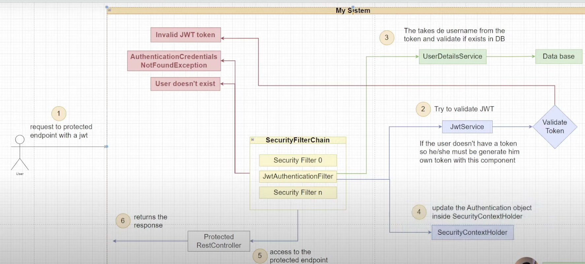

# Spring-security-Luis
En este proyecto se ve otra implementación de Spring Security con JWT

### **Se sigue la guía del video:**
### https://www.youtube.com/watch?v=735a83FQR2I

En esta implementación se usa la librería de token jwt - io.jsonwebtoken / jjwt-root

Se trata de seguir la siguiente arquitectura (tomada del video)


En el tema de la base de datos usada se utilizó docker

```
docker run --name microservice -e MYSQL_ROOT_PASSWORD=150919 -d -p 3306:3306 mysql:latest
```