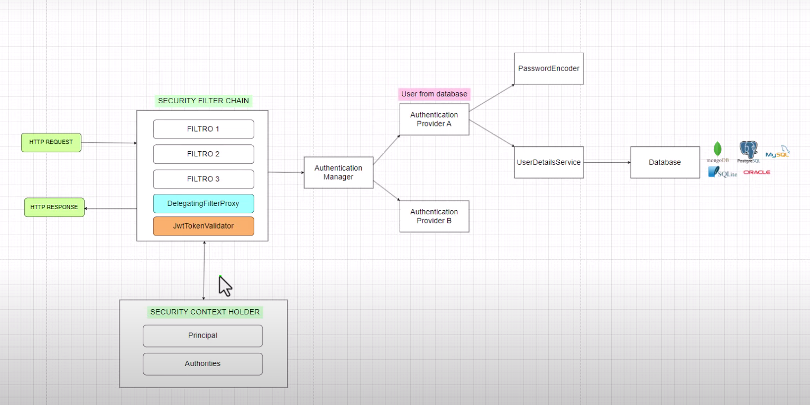

# Spring-security-JWT
En este proyecto se toma como base el proyecto SprinSecurityBasic y se agrega el uso 
de tokens JWT para la authentication

### **Se sigue la guía del video:**
### https://www.youtube.com/watch?v=wzGCBZCknUs

La arquitectura seguida dentro de los componentes y configuraciones de spring security aplicadas
en este proyecto son los de la siguiente imagen (tomada del video)

A diferencia de la otra aquitectura se agrega JWTokenValidator


Se sigue la guía del video:
https://www.youtube.com/watch?v=wzGCBZCknUs

En el tema de la base de datos usada se utilizó docker

```
docker run --name microservice -e MYSQL_ROOT_PASSWORD=150919 -d -p 3306:3306 mysql:latest
```